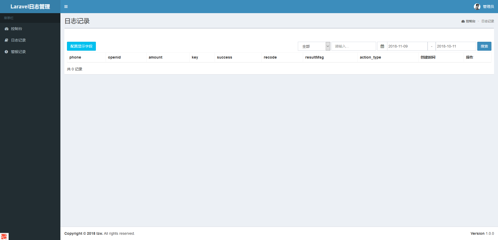
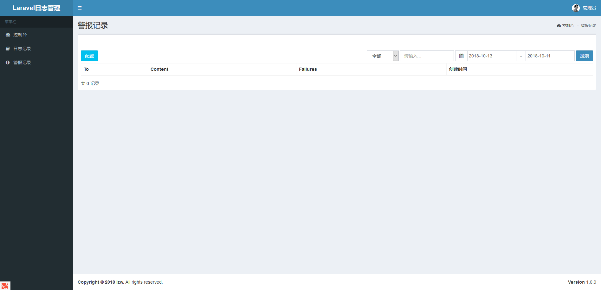

## Laravel+Mongodb日志管理系统

> GitHub地址：https://github.com/awei922/laravel-mongodb

使用Laravel框架通过扩展jenssegers/mongodb操作mongodb数据库组成的laravel日志管理系统 

### 安装及配置

```php
$ composer update
```

```php
$ php artisan migrate
$ php artisan key:generate
```

### 使用说明

* 日志记录

```
http://test.com/api/log/create
```

* 日志查看

```
http://test.com/admin
```
默认账号：admin@admin.com/123456

### 截图

> 日志记录



> 警告记录



### Bug反馈

http://mjiong.com/21907.html


